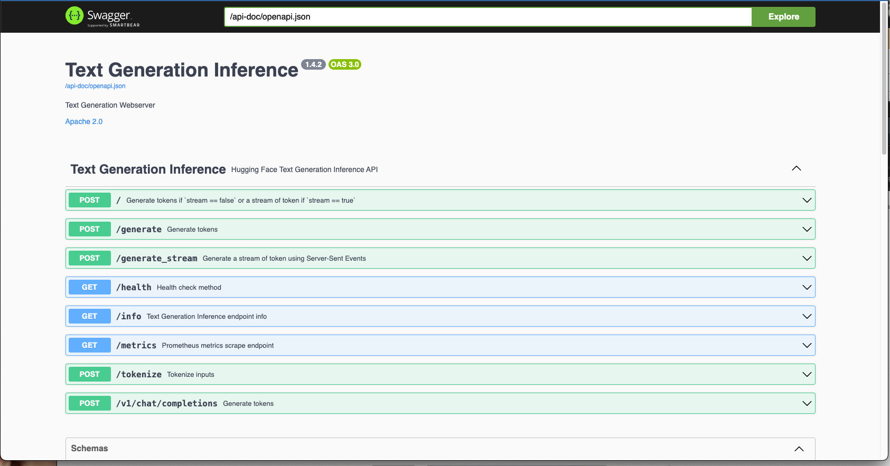

# Mistral on GKE

This example will demostrate how to serve [Mixtral 8X7B](https://mistral.ai/news/mixtral-of-experts/ "Mixtral 8X7B") model on [NVIDIA L4 GPUs](https://cloud.google.com/compute/docs/gpus#l4-gpus "NVIDIA L4 GPUs") running on Google Cloud Kubernetes Engine (GKE). It will help you understand the AI/ML ready features of GKE and how to use them to serve large language models.

## What is Mistral?

Mixtral 8X7B is the latest LLM provided by [Mistral.ai](https://mistral.ai "Mistral.ai")

## Before we get started... 
Make sure you have access to a Google Cloud project that supports NVIDIA L4s in your desired region per your quotas. This tutorial uses `us-central1` but you can use a different one if you choose to do so. Also make sure that you have acceess to a terminal that can execute `kubectl`.

## Building on Kubernetes

### Setting Environment Variable

Before we get started, we are going to set some environment variables. This is just to make our lives easier as we are going through the process of building our infrastucture. 

```bash
export PROJECT_ID=<your-project-id>
export REGION=<your region>
export ZONE_1=${REGION}-b 
export ZONE_2=${REGION}-c
export CLUSTER_NAME=mixtral-cluster
export NETWORK=<your network>
gcloud config set project "$PROJECT_ID"
gcloud config set compute/region "$REGION"
gcloud config set compute/zone "$ZONE_1"
```

You will want to replace `<your-project-id>` with you actual progrect. You will also do this with the region you desire. I defaulted the zones to `b` and `c` but you are able to change it to whatever you choose.

We also need to enable to project APIs

```bash
gcloud services enable compute.googleapis.com container.googleapis.com
```

Next, we will bind some service accounts to give us the necessary permiessions to store *metrics and logs* in [Cloud Monitoring](https://cloud.google.com/monitoring "Cloud Monitoring"). 

```bash
PROJECT_NUMBER=$(gcloud projects describe $PROJECT_ID --format='value(projectNumber)')
GCE_SA="${PROJECT_NUMBER}-compute@developer.gserviceaccount.com"

gcloud projects add-iam-policy-binding $PROJECT_ID \
--member=serviceAccount:${GCE_SA} --role=roles/monitoring.metricWriter
gcloud projects add-iam-policy-binding $PROJECT_ID \
--member=serviceAccount:${GCE_SA} --role=roles/stackdriver.resourceMetadata.writer
```

### Build our GKE Cluster

We will create a [GKE Cluster](https://cloud.google.com/kubernetes-engine "GKE Cluster"). This will be smaller than what you may have seen before in terms of node count. We will be creating a separate nodepool with our accelerators in the next step.

```bash
gcloud container clusters create $CLUSTER_NAME \
  --location "$REGION" \
  --node-locations="$ZONE_1" \
  --workload-pool "${PROJECT_ID}.svc.id.goog" \
  --enable-image-streaming --enable-shielded-nodes \
  --shielded-secure-boot --shielded-integrity-monitoring \
  --enable-ip-alias \
  --network=$NETWORK \
  --no-enable-master-authorized-networks \
  --addons GcsFuseCsiDriver   \
  --machine-type n2d-standard-4 \
  --num-nodes 1 --min-nodes 1 --max-nodes 4 \
  --ephemeral-storage-local-ssd=count=2 \
  --scopes="cloud-platform"
```

Now we will create our nodepool which will support L4 GPUs (2x)

```bash
gcloud container node-pools create g2-standard-24 --cluster $CLUSTER_NAME \
  --node-locations $ZONE_1,$ZONE_2 \
  --region $REGION \
  --accelerator type=nvidia-l4,count=2,gpu-driver-version=latest \
  --machine-type g2-standard-24 \
  --ephemeral-storage-local-ssd=count=2 \
  --enable-autoscaling --enable-image-streaming \
  --num-nodes=1 --min-nodes=0 --max-nodes=2 \
  --shielded-secure-boot \
  --shielded-integrity-monitoring
```

With that simple `--accelerator` tag, we were able to attach GPUs to our nodepool. The nodes will now have all the necessary drivers built into it. It will take a few minutes to provision so sit tight. After 10 minutes or so, you can run this command to see if the nodepool is ready

```bash
gcloud container node-pools list --region $REGION --cluster $CLUSTER_NAME
```

If they aren't deployed, just sit tight and try again in another 5 to 10 minutes.  You may also want to check if the GPUs are ready. You can do so with this command.  

```bash
kubectl get nodes -o json | jq -r '.items[] | {name:.metadata.name, gpus:.status.capacity."nvidia.com/gpu"}'
```

## Deploying Mixtral on GKE

Now we can deploy Mixtral. There are a few ways to do this such as with [Ollama](https://ollama.com/ "Ollama"). I am using [Hugging Face's Text Generation Inference](https://huggingface.co/docs/text-generation-inference/en/index). In the `manifests/` directory, you will see `mixtral-huggingface.yaml`. Let's look at the file. 

```yaml
apiVersion: apps/v1
kind: Deployment
metadata:
  name: mixtral-8x7b
spec:
  replicas: 1
  selector:
    matchLabels:
      app: mixtral-8x7b
  template:
    metadata:
      labels:
        app: mixtral-8x7b
    spec:
      containers:
      - name: mixtral-8x7b
        image: ghcr.io/huggingface/text-generation-inference:1.4.2
        resources:
          limits:
            nvidia.com/gpu: 2
        ports:
        - name: server-port
          containerPort: 80
        env:
        - name: MODEL_ID
          value: mistralai/Mixtral-8x7B-v0.1
        - name: NUM_SHARD
          value: "2"
        - name: MAX_BATCH_TOTAL_TOKENS
          value: "1024000"
        - name: MAX_BATCH_TOKENS
          value: "32000"
        - name: PYTORCH_CUDA_ALLOC_CONF
          value: "max_split_size_mb:512"
        - name: QUANTIZE
          value: "bitsandbytes-nf4"
        #- name: PORT
        #  value: "3000"
        volumeMounts:
          - mountPath: /dev/shm
            name: dshm
          - mountPath: /data
            name: data
      volumes:
         - name: dshm
           emptyDir:
              medium: Memory
         - name: data
           hostPath:
            path: /mnt/stateful_partition/kube-ephemeral-ssd/mistral-data
---
apiVersion: v1
kind: Service
metadata:
  name: mixtral-8x7b-service
  namespace: default
spec:
  type: LoadBalancer
  ports:
  - port: 80
    targetPort: 80
  selector:
    app: mixtral-8x7b
```

You will notice that we are using the `LoadBalancer` service. While this is no longer best practices, for the sake of this demo, we will deploy it. 

```bash
kubectl apply -f mixtral-huggingface.yaml
```

Now note, part of the process is downloading a number of weights (19 to be precise) and for the shards to run. Even if the pods appear to be running, it may be 10 to 15 minutes or so before you can actually start using the Mixtral LLM.

### Testing

At this point, you should be able to access the model via URL. You may be curious, what can you do now. Well let's look at the documentation. 

This step is also a good way to test if your model is running. Let's get the IP address of our service. 

```bash
URL=$(kubectl get service mixtral-8x7b-service -o jsonpath=’{.status.loadBalancer.ingress[0].ip}’)
echo “http://${URL}/docs"
```

The `echo` command will give you a URL that you can copy and paste into your browser. You should see something like this. 



If you see something similar to that image, congratulations, everything is working. If not, give it another 5 or so minutes and try again. 

If you click around, you can get sample documentation to show you how to call the Mixtral APIs and use the LLM. For example, choose the very first option. It will say `POST /`. You will see an option that says *Try It Out*. Click that and then a sample JSON body will apear. Click execute and it will run and give you a response. 

If you want to do a real test, choose the `/generate` option. 

```json
{
 "inputs": "[INST] You are a helpful, respectful and honest assistant. Always answer as helpfully as possible, while being safe. Your answers should not include any harmful, unethical, racist, sexist, toxic, dangerous, or illegal content. Please ensure that your responses are socially unbiased and positive in nature. If a question does not make any sense, or is not factually coherent, explain why instead of answering something not correct. If you don’t know the answer to a question, please don’t share false information. What is a Kubernetes secret?[/INST]",
 "parameters": {
 "best_of": 1,
 "do_sample": true,
 "max_new_tokens": 400,
 "repetition_penalty": 1.03,
 "return_full_text": false,
 "temperature": 0.5,
 "top_k": 10,
 "top_n_tokens": 5,
 "top_p": 0.95,
 "truncate": null,
 "typical_p": 0.95,
 "watermark": true
 }
}
```


## Clean Up

This LLM on GKE experiment will be expensive so once you are done, you will want to delete it. You can do this simply by running the following command. 

```bash
gcloud container clusters delete $CLUSTER_NAME — region $REGION
```

# Coming Soon... Pulumi!